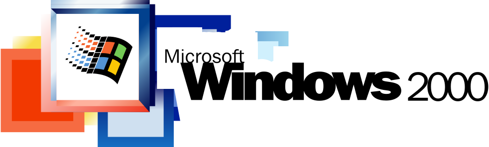
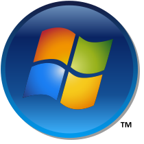

# GN-Legacy

#### Simple GN Build Toolchain for Legacy Windows.

This is the [GN](https://gn.googlesource.com/gn/) + [Ninja](https://ninja-build.org/) build system that [Chromium](https://www.chromium.org/) uses,
but minified and specifically designed for building C/C++ apps targeting legacy versions of Windows.  
In addition, the toolchain supports *running* on legacy Windows (down to XP).

### Motivation
GN-Legacy was built from the ground up for targeting legacy Windows (i.e. NT 4.0, 2000, XP, Vista, 7), but it can target modern Windows too.  
It makes building small or large C/C++ projects faster and easier. Makefiles don't have the cross
platform extensibility that GN provides, or the compilation speed that Ninja provides. I found existing
toolchains impractical, or they straight up don't work.

Existing projects that aim to simplify Win32 build toolchains often can't target anything older
than Windows 7 (Modern MSVC for example), or they are incomplete/hard to use. That's where this project comes in. There is
a small learning curve getting used to how GN works and how to write BUILD.gn files, but once you learn it, I feel almost
every C/C++ dev can appreciate what the build system has to offer.

   

## Getting Started

#### Prerequisites:
  This toolchain requires `git`, `zip`, `unzip`, and `curl`.
  For Debian based distros: `sudo apt install --needed git zip unzip curl`.
  On Windows, just install [Git for Windows](https://git-scm.com/install/windows); it has zip/unzip and curl preinstalled)

#### Initial Setup

First, clone the repo:

```bash
git clone --recursive https://github.com/Alex313031/gn-legacy.git
```

#### Without gclient
Then, we need to download the MinGW toolchains (See [About the Compiler](#about-the-compiler)). I host pre-built .zips of both the Windows and Linux (for cross-building) toolchains for i586/i686/x64.  
The script `download_toolchains.sh` will automatically detect whether you are on Linux or Windows and download the appropriate toolchains. It uses curl and unzip, so those have to be installed.  
This command also downloads the `gn` and `ninja` binaries this repo needs.

```bash
# (From Git Bash if on Windows)

./tools/download_toolchains.sh --all
```

#### With gclient
Since this repo uses GN/Ninja just like Chromium, you can also manage it with `gclient`. First, clone `depot_tools`:

```bash
git clone https://chromium.googlesource.com/chromium/tools/depot_tools.git
```
and add it to your `$PATH`. See [Here](https://commondatastorage.googleapis.com/chrome-infra-docs/flat/depot_tools/docs/html/depot_tools_tutorial.html#_setting_up) for more info.  

Then, from the directory *one level above* your `gn-legacy` checkout, generate a `.gclient` file with this one-liner:

```bash
gclient config --spec 'solutions=[{"name":"gn-legacy","url":"https://github.com/Alex313031/gn-legacy.git","managed":False,"custom_deps":{},"custom_vars":{"download_toolchain_sources":True,"download_sources":True}}]'
```

Lastly, run `gclient sync`. This is more robust than just `download_toolchains.sh` - in addition to running that script, it will also download the sources
for the [GN Fork](https://github.com/Alex313031/gn-xp#readme), the [Ninja Fork](https://github.com/Alex313031/ninja-xp#readme), and the [MinGW GCC + MinGW LLVM Toolchains](https://github.com/Alex313031/mingw-build#readme) that this repo uses.  
All of these have been modified to run on Win XP+. (So that gn-legacy can be used on XP+, and target NT 4.0+).

#### Building Programs
Now that we have downloaded the toolchains, we can start building some apps!  
Building can be done from __bash__ or __cmd.exe__. Using GN (which stands for "Generate Ninja"), we generate *.ninja* files that
Ninja can use to run the correct commands to compile your app(s).

First, choose your build arguments, (the "args"), and generate a build output directory for Ninja using GN:

```bash
# Must be subdir of "out", can be named whatever you like

./gn args out/Debug

# or in cmd.exe

gn.bat args out\Release

# --help to see all options
```
 A text editor will pop up, editing *out/$BUILDDIR/args.gn*, and here is where you set build arguments, such as target windows version, C++ standard, debug/release mode, etc.

Two sample *args.gn* files are provided to get up and running quickly, with comments explaining what the args do. Depending on whether you want a debug or release build,
choose either the [release_args.gn](./assets/args/release_args.gn) or [debug_args.gn](./assets/args/debug_args.gn) file. Copy the contents and paste it into the text editor, or type your own custom args.
Once you save the file and exit the text editor, gn will start generating .ninja files for all your sources.

Next, build it!  
Ninja will read the .ninja files generated in the previous step, and then invoke
the compiler and append the flags/directories needed to compile sources, according to configurations in [./build/](./build/):

```bash
# You can append the flag `-j#` at the end, where "#" is the number of jobs, for multi-threaded compile.
# You can append the flag `-v` at the end, to show verbose compilation logs.

./ninja -C out/build all -j4 # Build with 4 CPU cores

# or in cmd.exe

ninja.bat -C out\build all -v # Log each build step

# --help to see all Ninja flags
```

You can also clean a build output directory (equivalent to running `make clean`) like so:

```bash
./ninja -C out/build -t clean

# or in cmd.exe

ninja.bat -C out\build -t clean
```
 Your `.exe`/`.dll`/`.a` files should be in *out/build* (or whatever you named your build output directory).

#### Adding your own sources

Projects use *BUILD.gn* files in place of a `Makefile` or `.vcxproj` file. A BUILD.gn file describes the sources, configs, and project-specific
defines or compilation flags. They are hierarchical by design, and can depend on one another.  
Targets should be added as a subdirectory of `./src/`, and the target added to the [main BUILD.gn](./src/BUILD.gn) in `./src/BUILD.gn`.

See the [./test/win/](./test/win/) dir for a good example on making an .exe, .dll, and static .lib using inter-dependant *BUILD.gn* files.  
For more help, see [Resources](#resources).

### About the Compiler
It uses a custom [MinGW](https://www.mingw-w64.org/) toolchain + [patches](https://github.com/Alex313031/mingw-build/tree/master/patches)
and compiler configs to allow targeting all the way back to Windows NT 4.0.  There are [GCC](https://gcc.gnu.org/) and [LLVM](https://llvm.org/)
flavors too; you can control which is used to build your projects via the gn arg `use_llvm`.  
This toolchain is built from [my fork](https://github.com/Alex313031/mingw-build) of [mingw-w64-build](https://github.com/Zeranoe/mingw-w64-build).  
It also uses forks of GN and Ninja, that support running on Windows XP+. See https://github.com/Alex313031/gn-xp#readme and https://github.com/Alex313031/ninja-xp#readme.

### Resources

GN Quick Start Guide: https://github.com/Alex313031/gn-xp/blob/master/docs/quick_start.md (Has Chromium-specific stuff in there, but still helpful)

GN Reference: https://github.com/Alex313031/gn-xp/blob/master/docs/reference.md (How to use/write BUILD.gn files)

Ninja Manual: https://github.com/Alex313031/ninja-xp/blob/release/doc/manual.asciidoc (Markdown version of [Upstream Manual](https://ninja-build.org/manual.html))

### Acknowledgments

[Tim Niederhausen](https://github.com/timniederhausen) for his forks of GN and Ninja, which mine are based on.

[Christopher Wellons](https://github.com/skeeto) for showing me how to compile MinGW targeting old Windows.

[Chromium Team](https://source.chromium.org/chromium/chromium/src/+/main:AUTHORS) for these projects in the first place.

[w64devkit](https://github.com/skeeto/w64devkit) for helping show me how to make legacy compatible toolchains.
